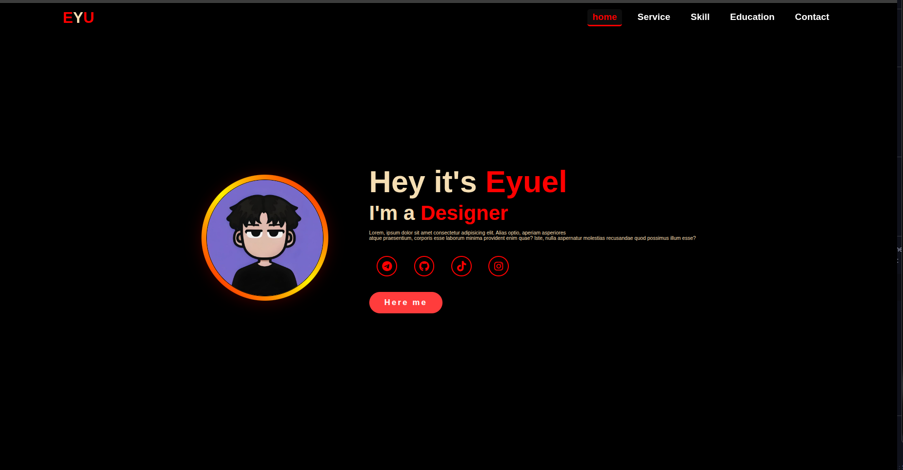

# Eyuel Profile Page

This is a modern, responsive student profile dashboard built with HTML and CSS.

## Features
- Profile image with a colorful circular border
- Responsive layout for desktop and mobile
- Animated and interactive UI elements
- Social media links
- Clean, modern design

## Getting Started
1. Clone or download this repository.
2. Open `index.html` in your web browser to view the dashboard.
3. Customize the profile information and image as needed.

## Profile Image Example

To use your own profile image, add a file named `photo1.jpg` to the project directory. Then, update the image tag in your HTML like this:

```html

```

If `photo1.jpg` exists in your project folder, it will appear as your profile image:



- `index.html` — Main HTML file for the dashboard
- `style.css` — All styles for layout, colors, and effects
- `README.md` — Project overview and instructions

## Technologies Used

- HTML5
- CSS3
- [Google Fonts: Poppins](https://fonts.google.com/specimen/Poppins)
- [Font Awesome 6](https://fontawesome.com/)
- `index.html` — Main HTML file for the dashboard
- `style.css` — All styles for layout, colors, and effects
- `README.md` — Project overview and instructions

## Customization
- To change the profile image, replace the `src` attribute in the `` tag in `index.html`.
- Edit the profile details and social links directly in the HTML.
- Adjust colors and effects in `style.css` as desired.

## License
This project is open source and free to use for personal or educational purposes.

